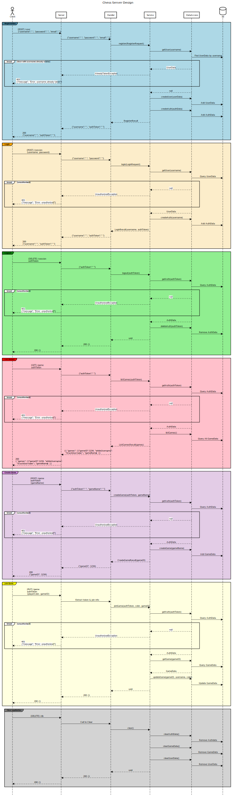

# ♕ BYU CS 240 Chess

This project demonstrates mastery of proper software design, client/server architecture, networking using HTTP and WebSocket, database persistence, unit testing, serialization, and security.

## 10k Architecture Overview

The application implements a multiplayer chess server and a command line chess client.

[](https://sequencediagram.org/index.html#initialData=C4S2BsFMAIGEAtIGckCh0AcCGAnUBjEbAO2DnBElIEZVs8RCSzYKrgAmO3AorU6AGVIOAG4jUAEyzAsAIyxIYAERnzFkdKgrFIuaKlaUa0ALQA+ISPE4AXNABWAexDFoAcywBbTcLEizS1VZBSVbbVc9HGgnADNYiN19QzZSDkCrfztHFzdPH1Q-Gwzg9TDEqJj4iuSjdmoMopF7LywAaxgvJ3FC6wCLaFLQyHCdSriEseSm6NMBurT7AFcMaWAYOSdcSRTjTka+7NaO6C6emZK1YdHI-Qma6N6ss3nU4Gpl1ZkNrZwdhfeByy9hwyBA7mIT2KAyGGhuSWi9wuc0sAI49nyMG6ElQQA)

## Modules

The application has three modules.

- **Client**: The command line program used to play a game of chess over the network.
- **Server**: The command line program that listens for network requests from the client and manages users and games.
- **Shared**: Code that is used by both the client and the server. This includes the rules of chess and tracking the state of a game.

## Server Structure

The following sequence diagram represents the design of my chess server. The chess server exposes seven endpoints. An endpoint is a URL that maps to a method that handles HTTP network requests. My chess client calls the endpoints in order to play a game of chess. Each of these endpoints convert the HTTP network request into service object method calls, that in turn read and write data from data access objects. The data access objects persistently store data in a database. The service object method uses the information from the request and the data access objects to create a response that is sent back to the chess client through the HTTP server.

[](https://sequencediagram.org/index.html#initialData=C4S2BsFMAIGEAtIGcnQMqQE4DcvQCLIgDmAdgFDkCGAxsAPaZzgiSnDkAOVmoNI3duiy5MXHnwFUhACWkATKGO68Q-QcGE41kcavXTN+KsCoBBGjWRJy8k1QBGVJDHkPKbYJgCeSbv1JiaAAGADoATkpiTHoAV04AYgAWAGYADgAmcJpoBJZieGAHcFiYACVIYhAkLxMQegpYFk9oAFoAPi1RAC5oAG0ABQB5NAAVAF1oAHpYl0wAHVIAbwAiWaxSKgBbSBXulegVgBpD7hQAd0Z5PYPjw8gtqhBwG8OAX3IMHDwO6DlSRRYXqrdaYTY7V53FZnJCXTDXfaHE4rB5PF6IlYff6Api-L7YHS9TCVarALAACgqVRqWAqAEdSjUAJSfEQ6NqdYymCxWFC9YiQYAAVTm5NB4MgLK55ks1g50Dc3QAYiAAdARVhpdAHN5oOLtroHMSqABrdVzaDnMDwPVzCXQKjgY3yXWQAAepJs0p5ctaeLZVl6Gsw0tZ2isbX930wvTMTsgVBdo1NbAAom6rJxQA0w6JI50mqx2L0ksEUotVjsUFQBXtDqnMDEY7aNgaHfHE7rTCa2JjyGx5ORvbKUPmuoToKRYuBwLn2b9h7ykN0aMaycGxXNpVL7D7R79FWZ5PJzZr7HOIwvdyPl6uE2SzLFgPByVQn-Bt0Pr0v5Yfj9BH2fUN8XnX5sSUXoqVJWlkGnDhwJ+KMemgEE7QNSFkTfZ9RnoHtSEhD58UQgtmmLaAMmCYIKzWNCIQxTD3xwvCCP7AEohieIEkYaQBVyJVYFTfBYDMaAABl6CqRpSM0JCgX6YYxkmKYXBQepSArfUdhOGE4XkQiRB+ToEObVDWzo25kR0q4WOM+UQMDaBwAk1VyXEyT6UZYAWXsmAr25G9+UFDdNMlL9-J-A8HF6ABFUofFPENzyNBMzViTZ30YEAAC9IEHRdfSQicpxnC9fNk5shXS59Mpy+R00zbMKCI3FfkLTwS2CABGaiqyQGtdl6FYGybXo0qw+AatyvsB1K+V8r5aA7xMSBAJfEKd3C31OkVAD-1W4CAzKoyFAgsTnNICokDgzczMgE5xqYtgWVsv1Oma4EaNujDDge3DewxfTozHNqyIoqjlk+sF0Pon7GL+-CAdYwdKHIaI4kSaJIDYXJ8kKTHsbcuIOBBmS3oM5s+nwVNRNTUZUyUlSkDUxZfrw3NDL+E65NWVn-tuLEudxMnw0gXonOIInXzhvDvMOubv2sQLgFWqXsPhllktNPUqomzBstysKZQiwqHOK2cfLHd71R1ya6ozSAszU9mWpIotgA67qId6-q6yGxtGFGm29dq6a2ItvyjcVhVICgB931V+BHtIDbI-3baougCotnoXAAPfA6RbHYzemwegQEHF7yt6MGUMBvNXuYN3q8o2ukfY9GEmJE8Ek4VUzVE0loAAcQNGwSbs8nej6IfaaU4gDRZ6W2Gd+Vi5QlZeYR-nyBe4WCQclgahHqsE6T2XC4jvdl2gAVlfjzeNeNVKg-1vKFf3E3RcnadzblhurcquNW29UHaNRXg3EmHserWB9oNYaAdtZAODlND4M1w6cnftfQ+wBj7IHJCnK+v4M6xSwLqOM4Bh4GgLvvI6nMASnQHkfUel1rrzyrM9QWltJ4oSWIcNhyA6x9FWPwgAkvgPYnUMgpCSMic48AwCQGDBKG4xxFiHGKLQE0SjoYrChPwgAcgafYmJoDjDrsRRu7VyKUQrHw0egjhEGjERIqRMjDhyIUdo8yqjSDqPAJorxA1dHIgMUY3RbxTGoLYqjDiiR5AAHZwjBEgMEXIqYUiwAEgANjgGuGAuDyDjyrvJEYExpj8MXmrPCFZQk7HMULOhOIPqb2+isWpQT3g704Z-XoS0yS4NPvDE47Tz40PlptBat8VYP3IJrZ+SDX6G0If-Q6vQzazRWdGIML9aogMdjmZqwNpJQK9jA2scD-bNjGhlZB1womDnQQQTBvS8kDJGUsm8RDYz-lwdQ0Cx16FyVgK8g0LDwDAHJKI-AHDAUuy6NzNpTjxG9EkdI+pRym7WPBo4nYziUWuPue3Ti3gY5OXODjEghQSUznoOSgAUmXXxBSil7zkoMIUZSpgVJ1knCsnB-EkswLAegTlMDDKReisCgtejplqHQaADA8LQAAGTQAAFaMugKqAAZvQLpsKJ4i16Bq1UAzN4nBoCKxg4rcXQo2RgiZ18pn3yXsnWZT9EE3MWfNVAmyaFrJ-hs4pgCvW7Ptvspq5MMVWNLJ7SsZyBr1kuYHBZIdCWPJ9UrN5SLRnzgdana+8Q7D9INJCpFJwQoWqtZgAhnzIpBk4MW-JVDzzhylbCkuZcK7dOKTXJYkrWrHKxa3GaMSO7RCoLqPIlLgATt1E0BMTAqCcH5WoOoOYWXwoplTGmdMlJuHAQCppcBHQUIYMwRd+qcSGv9YtKAPB8H2qeY63p97MCPp9V8zODwc4wFPQqVtf923HtLuXK9SguFbOHf28Bg7MV9vuUAA)

## IntelliJ Support

Open the project directory in IntelliJ in order to develop, run, and debug your code using an IDE.

## Maven Support

You can use the following commands to build, test, package, and run your code.

| Command                    | Description                                     |
| -------------------------- | ----------------------------------------------- |
| `mvn compile`              | Builds the code                                 |
| `mvn package`              | Run the tests and build an Uber jar file        |
| `mvn package -DskipTests`  | Build an Uber jar file                          |
| `mvn install`              | Installs the packages into the local repository |
| `mvn test`                 | Run all the tests                               |
| `mvn -pl shared test`      | Run all the shared tests                        |
| `mvn -pl client exec:java` | Build and run the client `Main`                 |
| `mvn -pl server exec:java` | Build and run the server `Main`                 |

These commands are configured by the `pom.xml` (Project Object Model) files. There is a POM file in the root of the project, and one in each of the modules. The root POM defines any global dependencies and references the module POM files.

## Running the program using Java

Once you have compiled your project into an uber jar, you can execute it with the following command.

```sh
java -jar client/target/client-jar-with-dependencies.jar

♕ 240 Chess Client: chess.ChessPiece@7852e922
```
